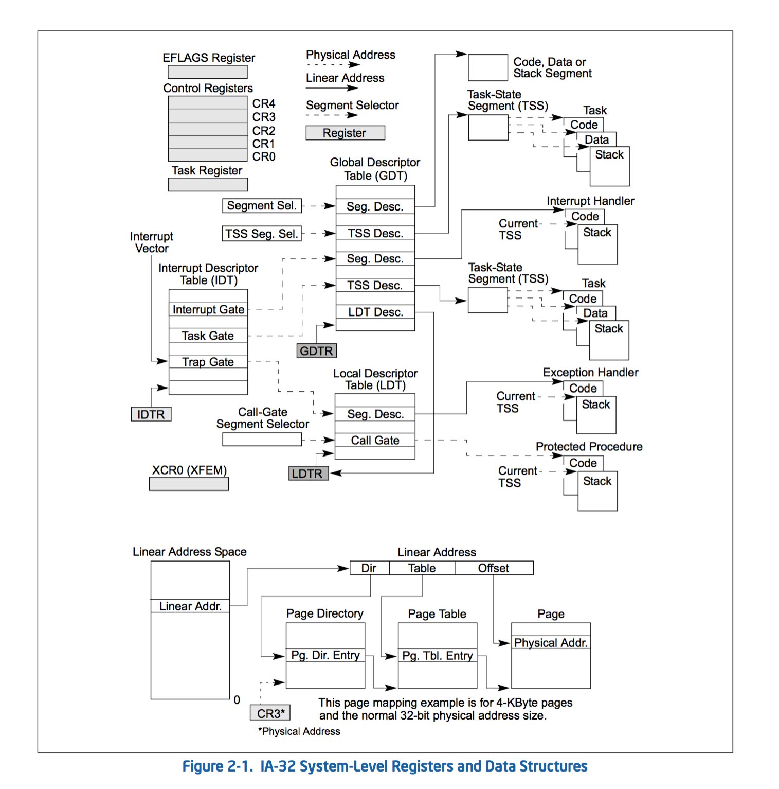

# Gates in IA-32e Mode [IA-32e下的门]

在IA-32e模式下，以下的描述符是16字节的：LDT描述符，64位TSS,调用门，中断门和陷阱门。

调用门使64位模式和管理模式之间的转换变的容易。任务门不支持IA-32e模式。特权级发生变化时，堆栈选择器不从TSS读取。它们被置位。

在TSS中（见图2-1），定义了一个任务执行环境的状态。它包括通用寄存器，段寄存器的状态，EFLAGS寄存器，EIP寄存器，并且包含三个堆栈段栈指针（一个堆栈每个特权级）。 TSS还包括与任务和分页结构的基地址相关联的LDT段选择子。

所有执行在保护模式下的程序（称为当前任务）的范围内。 当前任务的TSS段选择子存储在任务寄存器TR。用于切换到任务的最简单的方法是调用或跳转到新任务。这里，为新任务的TSS的段选择在CALL或JMP指令中给出。在切换任务时，处理器会执行以下操作：
- 将当前任务的状态存储在当前任务的TSS。
- 为新的任务加载段选择子到任务寄存器TR。 
- 通过在GDT段描述符访问新的TSS。
- 加载新的TSS到通用寄存器，段寄存器，LDTR，控制寄存器CR3（分页结构的总纲），EFLAGS寄存器，EIP寄存器。
- 执行新的任务
  
任务也可以通过任务门访问。任务门类似于调用门，但它提供了访问（通过段选择）到TSS而不是一个代码段。

  
