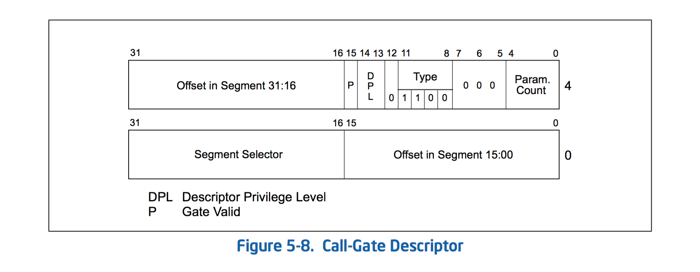

# Call Gates [调用门]
调用门用于不同权限级别之间的程序控制与转移。它们通常仅在使用特权级保护机制的操作系统中使用。调用门同时也用来在16位和32位的段间转移控制权限。如第21.4节“在混合尺寸的代码段中交换控制权。”

图5-8显示了一个调用门描述符的格式。一个调用门描述符可以装载到GDT或LDT中。但不可以装载到IDT（中断描述符表）。它有六大功能：

- 它指定代码段进行访问。
- 它指定了程序在明确代码段中入口点。
- 它规定了调用该过程所需要的特权级别。
- 如果堆栈发生了切换，它明确了堆栈间复制的可选参数的数目。
- 它定义了推送到目标堆栈的数据大小。16位门用16位，32位门用32位。
- 它指定了调用门描述符是否有效。

段选择器区域指定了要访问的代码段。偏移区域指定了代码段中的入口点。这个入口点通常是程序的第一条指令。DPL区域表示了调用门的特权级（允许访问调用门的特权级别）。P位表示了调用门的有效性（代码段是否存在是由代码段描述符的P位指定的）。参数统计域指出了切换时堆栈传递的参数个数。（参见5.8.5 堆栈切换）。参数统计域规定了传递参数的16位门的字个数和32位门的双字个数。

注意，一个门描述的P标志通常总是被设置为1，如果它被设置为0，当一个程序试图访问描述符时将产生不存在（＃NP）异常。操作系统可以使用P标志的特殊用途。例如，它可被用来追踪门使用的次数。（标志P初始设置为0，引起异常执行NP异常处理程序。异常处理程序然后递增一个计数器，并设置在P标志设置为1，使得在从所述处理程序返回，门描述符重新生效。）