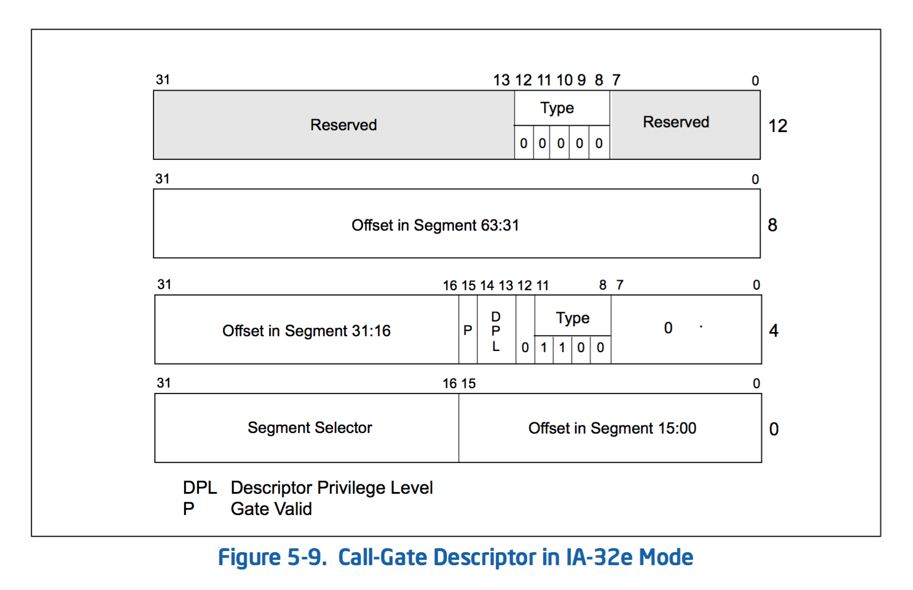

# IA-32e Mode Call Gates [IA-32e模式下的调用门]
32位模式为门述符提供了一个32位的指令指针（EIP）偏移;64位下，扩展为32位模式调用门的尺寸的一倍，以存储64位指令指针（RIP）。参见图5-9：

- 一个64位模式调用门（字节0-7）是相似但不完全相同于传统的32位模式调用门。参数拷贝计数字段已被删除。
- 字节8-11指定了目标段的偏移规范构成的高32位。如果软件试图使用一个不按规范构成生成的调用门，将会产生一个一般保护性异常（#GP）。
- 16字节的描述符可装载在兼容16位和32位描述符相同的描述符表。A类型域，用作一致性检查。定义在64位描述符的最高的双字 8-12位 部分（清零）。如果试图访问一个64位模式描述符的上半部分作为一个32位模式描述符将产生一般保护异常（#GP）。
- 由64位的调用门调用的目标代码段必须是64位代码段（CS.L= 1，CS.D= 0）。如果不是，则产生一个一般保护性异常，#GP。
- 只有64位模式调用门可以在IA-32E模式（64位模式和兼容模式）来引用。
- 传统32位模式调用门（0CH）在IA-32E模式被重新定义为64位调用门;IA-32E模式没有32位调用门存在。
- 如果一个远调用引用了IA-32E模式下的16位调用门型（04H），则生成一般保护性异常（#GP）。

  
当调用引用了64位模式调用门，与32位下的情况基本是相同的，但下列情况除外：
- 在入栈以八字节为单位进行。
- 一个64位指针RIP压入堆栈。
- 不进行参数复制。
使用匹配远返回指令大小为正确的操作数（从64位的调用必须以一个64位操作数大小返回以正确地处理栈）。
  
  
